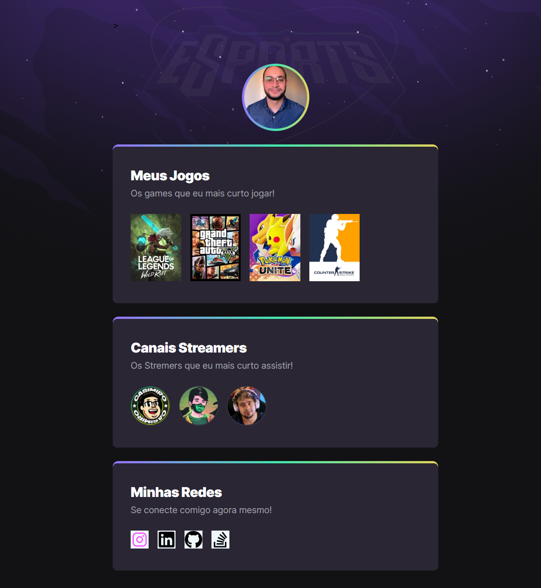

# 
Rooketseat_NLW_Explorer 🚀

 
 

  

   
   

  >## 
Meu primeiro projeto front end com HTML + CSS + Javascript

  
  
  

 
 

# 
[Clique aqui para acessar](https://lucas-vreal.github.io/NLW-Explorer/index.html)

   
   

 Dos dias 11 a 18 de Setembro, embarquei nas missões:
  <ul>
    <li> NLW | Mission Explorer (para quem está iniciando)</li>
    <li> NLW | Mission Ignite (para quem já é dev)
</li>
  </ul>

